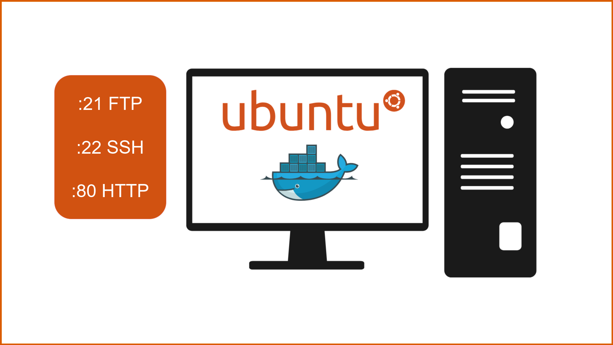

## Objetivo Maquina 1
Esta maquina va ser diseñanada para explotar la vulneravilidad ***A05:2021 - Configuración de Seguridad Incorrecta***.

## Plantemiento
Para ello va a alojar varios servidores, ftp,ssh y un apache que va a alojar un wordpres. El servidor ftp va a ser accesible de manera anónima, y en el se encontrarán las credenciales para acceder al wordpres desde el cual se podrá conseguir una reverse shell al servidor como el usuario www-data. Desde el usuario www-data no será posible acceder como root, primero tendrás que hacer movimiento lateral hacia otro usuario local desde el cual sí se podrá acceder como root. 

## Configuración del entorno
Para ello, vamos a crear un contenedor Docker con el sistema operativo Ubuntu Server. Los servicios que vamos a utilizar son:

- **FTP**: *vsftpd* version 3.0.3 --> Para transferencia de archivos.
- **SSH**: *OpenSSH 9.6p1* --> Para acceso remoto seguro.
- **HTTP**: *Apache 2.4.58* --> Para el servidor web.
 
## Pasos a seguir

1. **Instalación de Docker**
2. **Creacion del Dockerfile**

