# índice

1.[ Desarrollo Formulario Vulnerable a SQLi](#desarrollo-formulario-vulnerable-a-sqli)
   
2.[Instalación de Docker Creación y Desarrollo Contenedor Numero 1](#instalación-de-docker-creación-y-desarrollo-contenedor-numero-1)

3.[Prueba Instalación MariaDB](#prueba-instalación-mariadb)
   
4.[Instalación PHP y Prueba Conexión DB con Validador](#instalación-php-y-prueba-conexión-db-con-validador)

5.[Instalación PHP y Prueba Conexión DB con Validador](#prueba-creación-de-snapshot-en-docker)

6.[Implementación 1r CVE Extra File Upload](#implementación-1r-cve-extra-file-upload)


# [Desarrollo Formulario Vulnerable a SQLi](#índice)

Para el desarrollo del formulario hemos empleado únicamente HTML, CSS y PHP.

- **HTML:** Estructura del formulario
- **CSS:** Personalización del formulario
- **PHP:** _Backend_ del formulario (validación & conexión con la base de datos)

El script en php está hecho de manera que no valida correctamente la entrada. De esta manera es vulnerable a inyección SQL.

# [Representación gráfica de la validación errónea:](#índice)

<p align="center">
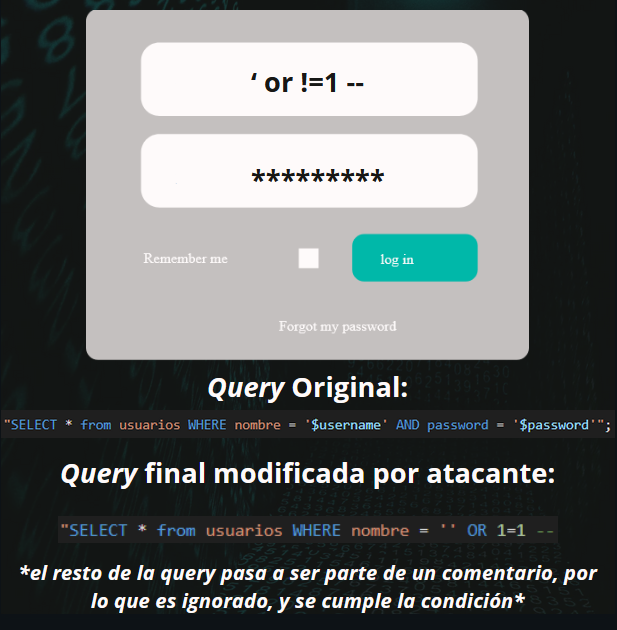
</p>

# [Apariencia final del formulario:](#índice)

<p align="center">

</p>

# [Instalación de Docker Creación y Desarrollo Contenedor Numero 1](#índice)

Para el desarrollo del primer contenedor, instalamos Docker siguiendo el [tutorial](https://docs.docker.com/engine/install/ubuntu/#install-using-the-repository) de la documentación oficial de Docker. Una vez hecho esto comenzamos con la creación del contenedor de manera manual:

<p align="center">
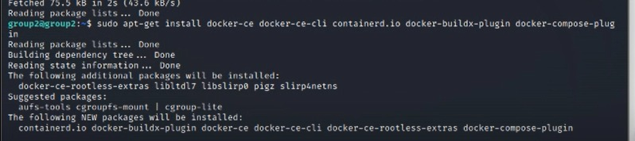
</p>

Descargamos la imagen de ubuntu para docker:

<p align="center">
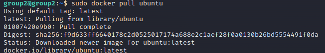
</p>
<p align="center">
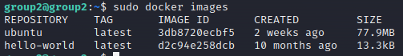
</p>

A continuación creamos el contenedor con esta imágen:

<p align="center">
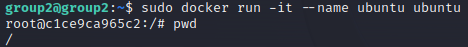
</p>

## [Prueba Instalación MariaDB](#índice)

Para instalar y poner contraseña a root dentro del contenedor:

```
apt install mariadb-server
service mariadb start
mariadb
```

Una vez dentro:

```
USE mysql;
ALTER USER 'root'@'localhost' IDENTIFIED BY 'contraseña';
flush privileges;
exit;
```

A continuación accedemos con el usuario root con el comando:

```
mysql -u root -p
```

Para crear la base de datos y un usuario válido en el formulario SQLi:

```
CREATE DATABASE db1;
use db1;
CREATE TABLE users(id CHAR(30) NOT NULL,user CHAR(20) NOT NULL,password CHAR(20) NOT NULL);
INSERT INTO users VALUES ('0','usuarioPrivilegiado','passUserPriv1');
```

Comprobación:

<p align="center">
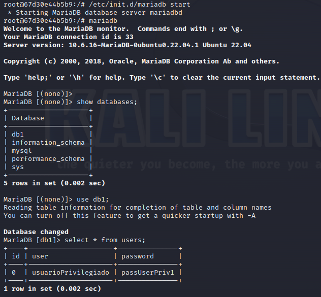
</p>

# [Instalación PHP y Prueba Conexión DB con Validador](#índice)

Instalamos php y sus respectivos módulos:

<p align="center">
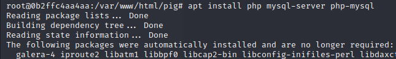
</p>

## [Prueba Creación de Snapshot en Docker](#índice)

Comando empleado:

```
sudo docker commit ubuntu ubuntu1
```

<p align="center">
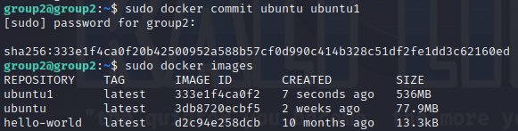
</p>

Y para ejecutarla:

```
sudo docker run -it --name ubuntu1 ubuntu1
```

<p align="center">
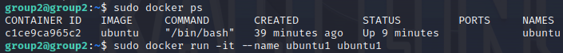
</p>

## [Implementación 1r CVE Extra File Upload](#índice)

En primer lugar descargamos el software y lo descomprimimos en la ruta /var/www/html. Una vez hecho esto creamos la base de datos:

<p align="center">
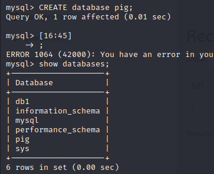
</p>

A continuación importamos el archivo .sql que viene con el software, y verificamos que se hayan creado las tablas:

<p align="center">
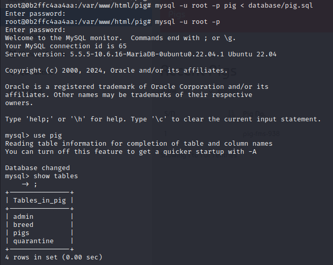
</p>

Finalmente comprobamos accediendo mediante el navegador:

<p align="center">
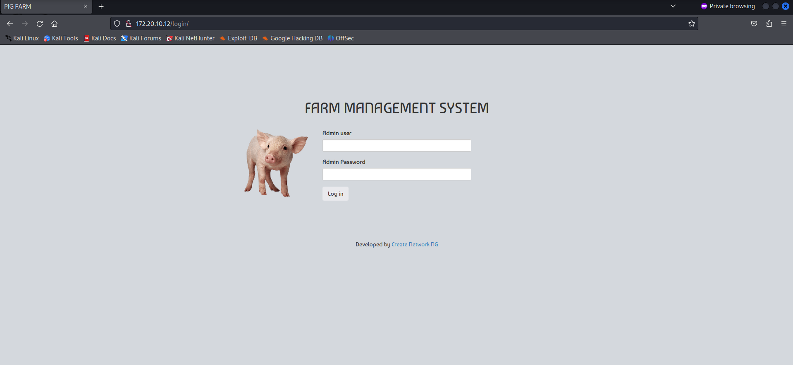
</p>

E iniciamos sesión para verificar que está conectado con la base de datos de igual manera:


<p align="center">
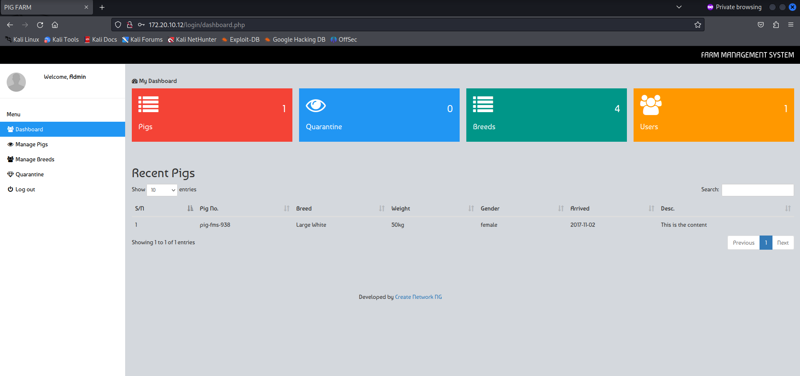
</p>
