# Índice

1. [ Desarrollo Formulario Vulnerable a SQLi](#desarrollo-formulario-vulnerable-a-sqli)
   
2. [Instalación de Docker Creación y Desarrollo Contenedor Numero 1](#instalación-de-docker-creación-y-desarrollo-contenedor-numero-1)

3. [Prueba Instalación MariaDB](#prueba-instalación-mariadb)
   
4. [Instalación PHP y Prueba Conexión DB con Validador](#instalación-php-y-prueba-conexión-db-con-validador)

5. [Instalación PHP y Prueba Conexión DB con Validador](#prueba-creación-de-snapshot-en-docker)

6. [Implementación CVE Extra](#implementación-cve-extra)


# [Desarrollo Formulario Vulnerable a SQLi](#índice)

Para el desarrollo del formulario hemos empleado únicamente HTML, CSS y PHP.

- **HTML:** Estructura del formulario
- **CSS:** Personalización del formulario
- **PHP:** _Backend_ del formulario (validación & conexión con la base de datos)

El script en php está hecho de manera que no valida correctamente la entrada. De esta manera es vulnerable a inyección SQL.

# [Representación gráfica de la validación errónea:](#índice)

<p align="center">

</p>

# [Apariencia final del formulario:](#índice)

<p align="center">

</p>

# [Instalación de Docker Creación y Desarrollo Contenedor Numero 1](#índice)

Para el desarrollo del primer contenedor, instalamos Docker siguiendo el [tutorial](https://docs.docker.com/engine/install/ubuntu/#install-using-the-repository) de la documentación oficial de Docker. Una vez hecho esto comenzamos con la creación del contenedor de manera manual:

<p align="center">

</p>

Descargamos la imagen de ubuntu para docker:

<p align="center">

</p>
<p align="center">

</p>

A continuación creamos el contenedor con esta imágen:

<p align="center">

</p>

# [Prueba Instalación MariaDB](#índice)

Para instalar y poner contraseña a root dentro del contenedor:

```
apt install mariadb-server
service mariadb start
mariadb
```

Una vez dentro:

```
USE mysql;
ALTER USER 'root'@'localhost' IDENTIFIED BY 'contraseña';
flush privileges;
exit;
```

A continuación accedemos con el usuario root con el comando:

```
mysql -u root -p
```

Para crear la base de datos y un usuario válido en el formulario SQLi:

```
CREATE DATABASE db1;
use db1;
CREATE TABLE users(id CHAR(30) NOT NULL,user CHAR(20) NOT NULL,password CHAR(20) NOT NULL);
INSERT INTO users VALUES ('0','usuarioPrivilegiado','passUserPriv1');
```

Comprobación:

<p align="center">

</p>

# [Instalación PHP y Prueba Conexión DB con Validador](#índice)

Instalamos php y sus respectivos módulos:

<p align="center">

</p>

# [Prueba Creación de Snapshot en Docker](#índice)

Comando empleado:

```
sudo docker commit ubuntu ubuntu1
```

<p align="center">

</p>

Y para ejecutarla:

```
sudo docker run -it --name ubuntu1 ubuntu1
```

<p align="center">

</p>

# [Implementación CVE Extra](#índice)

Estos son los CVE extras que hemos elegido:
   - CVE-2023-37629

 Que es CVE-2023-37629?
 esta vulnerablidad es sobre la carga de archivos. Un usuario no autenticado puede cargar un archivo php.
 
 La solucion para CVE-2023-37629?
 
Actualizar los programas o filtrar y limitar los paquetes subidos por el usuario 
 
En primer lugar descargamos el software y lo descomprimimos en la ruta /var/www/html. Una vez hecho esto creamos la base de datos:

<p align="center">

</p>

A continuación importamos el archivo .sql que viene con el software, y verificamos que se hayan creado las tablas:

<p align="center">

</p>

Finalmente comprobamos accediendo mediante el navegador:

<p align="center">

</p>

E iniciamos sesión para verificar que está conectado con la base de datos de igual manera:


<p align="center">

</p>

# [Creación de Usuarios](#índice)

Creamos todos los usuarios que formarán parte del CTF, entre los que se encuentran:

- pastorPaco 
- pastorJose
- granjero

<p align="center">
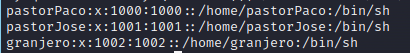
</p>

El escalado a root se hará desde el usuario "granjero". El usuario "pastorPaco" será el usuario puente hacia "granjero". Y el usuario "pastorJose" es un simple _rabbit hole_.

# [Implementación de Logs](#índice)

Para poder realizar un análisis forense una vez explotada la máquina, hemos mejorado el código de los scripts de validación de ambos formularios con la finalidad de almacenar logs de inicio de sesión, almacenando los campos introducidos por el cliente:

<p align="center">
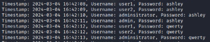
</p>

# [(NOT FINISHED) Walkthrough](#índice)

En primer lugar hacemos un escaneo de puertos para ver qué puertos hay abiertos:

<p align="center">
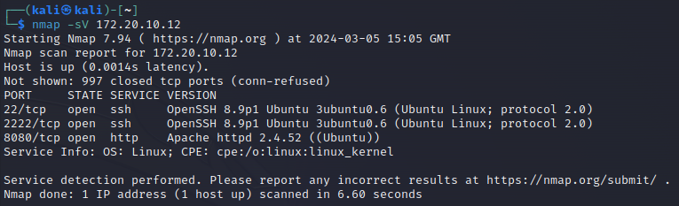
</p>

A continuación accedemos vía navegador al puerto 80 para ver la web:

<p align="center">
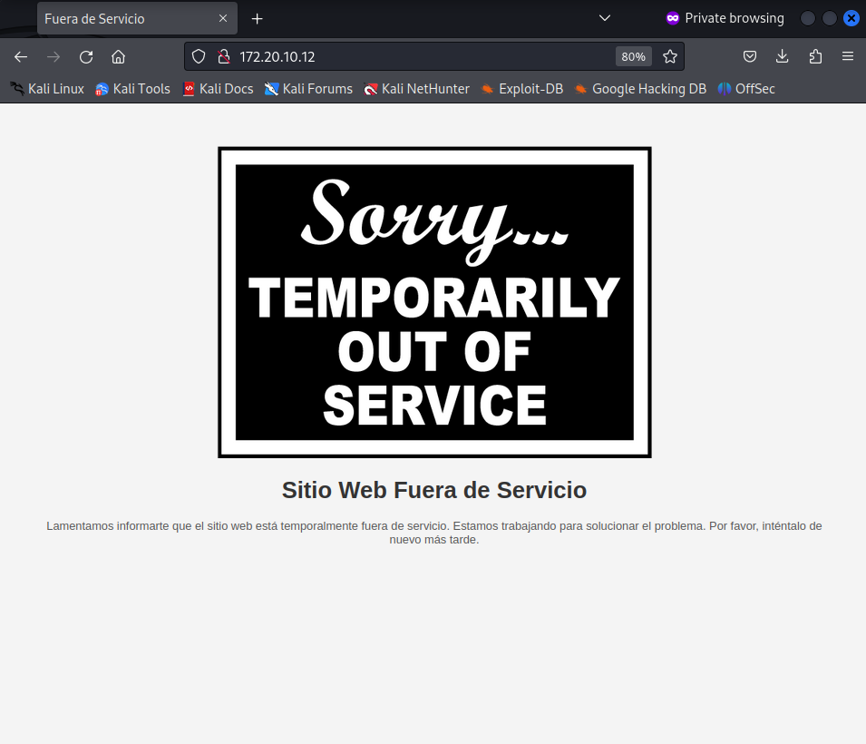
</p>

Parece que no hay nada interesante, hacemos un ataque de fuzzing al URL para ver posibles directorios ocultos y encontramos el siguiente:

<p align="center">
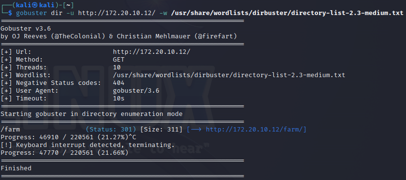
</p>

Accedemso y aparentemente hay un panel de inicio de sesión. No parece ser vulnerable, así que intentamos hacer fuerza bruta sobre este formulario con BurpSuite:

<p align="center">
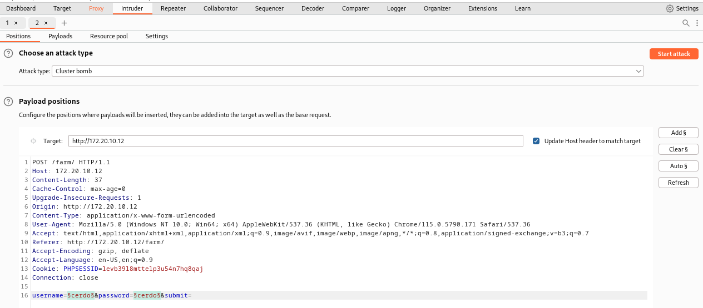
</p>

<p align="center">
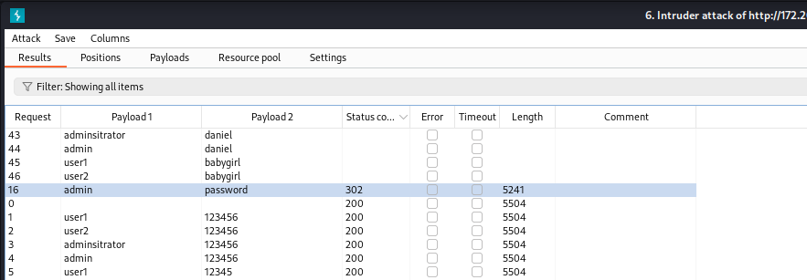
</p>

Se diferencia un código de status 302, por lo que probamos esas credenciales y en efecto son funcionales:

<p align="center">
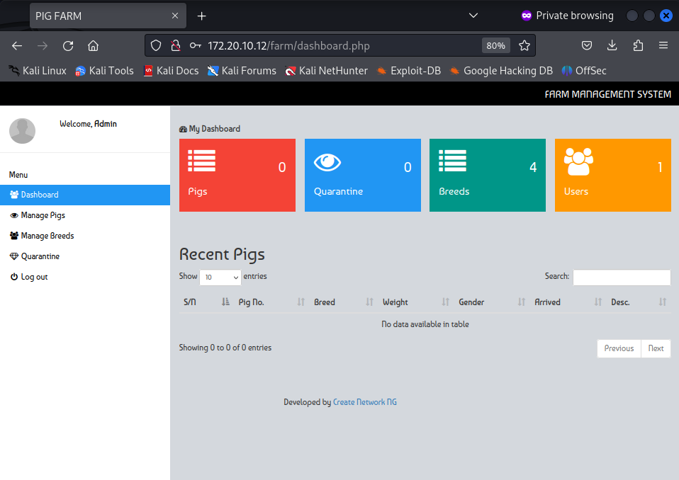
</p>

A continuación exploramos un poco el panel de administración y encontramos una función donde puedes añadir un cerdo a la base de datos. En este formulario te deja subir una imagen, sin embargo se nos permite subir un archivo .php ya que no está bien sanitizado:

<p align="center">
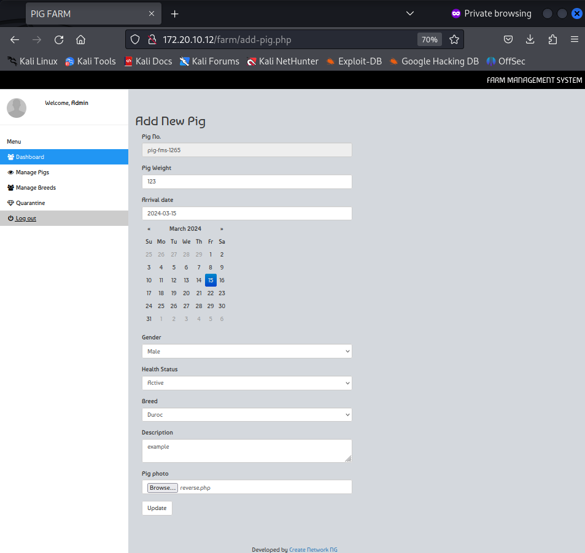
</p>

<p align="center">
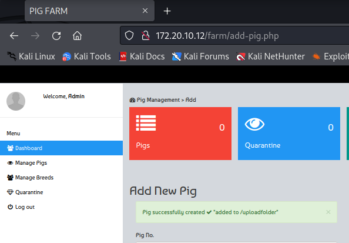
</p>

A continuación ponemos un puerto en escucha y ejecutamos el archivo .php que hemos subido y cuya función es ejecutar una reverse shell:

<p align="center">
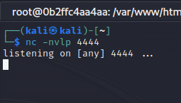
</p>

<p align="center">
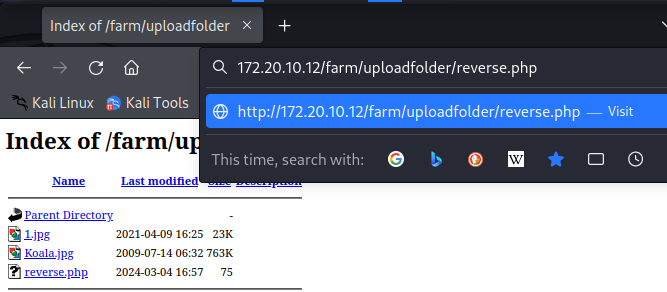
</p>

Y ya estamos conectados a la máquina con el usuario **www-data**:

<p align="center">
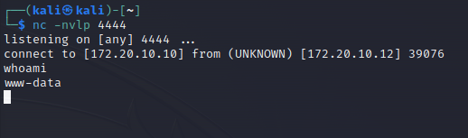
</p>

Con este usuario encontramos un directorio diferente dentro de /html:

<p align="center">
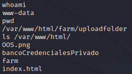
</p>

Accedemos vía navegador y encontramos otro panel de inicio de sesión:

<p align="center">
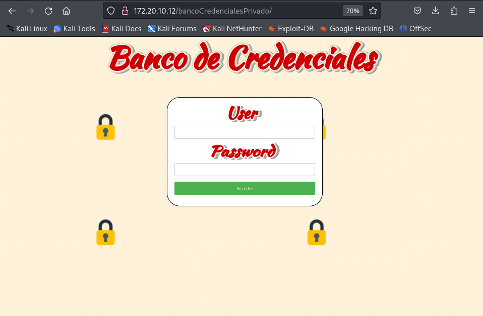
</p>

Afortunadamente este sí es vulnerable a SQL Injection por lo que nos facilita en gran medida el bypass de acceso:

<p align="center">
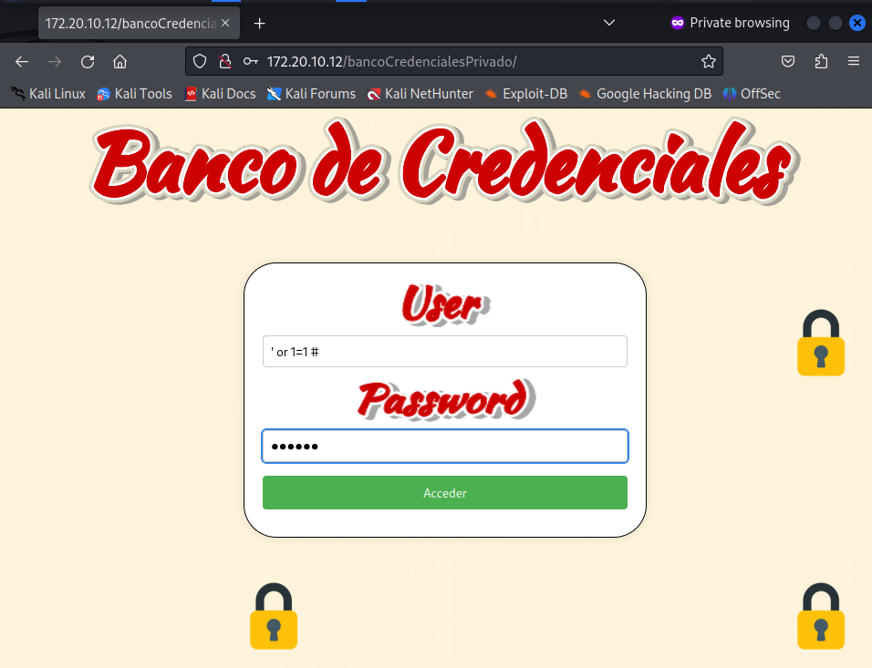
</p>

Una vez hecho el bypass, nos redirige a un "banco de credenciales" donde parece haber las credenciales de varios usuarios, aparentemente encodeadas en :

<p align="center">
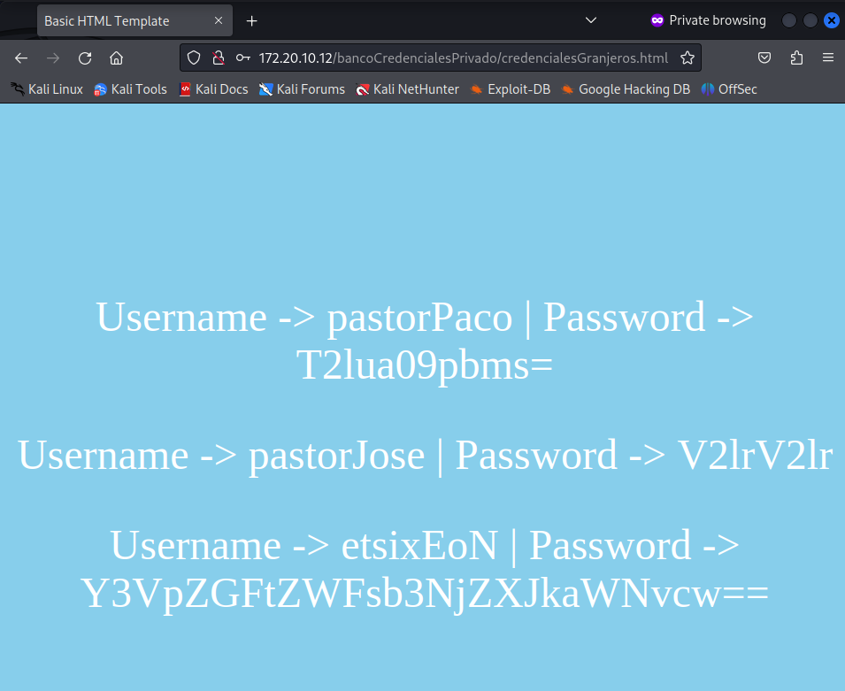
</p>
