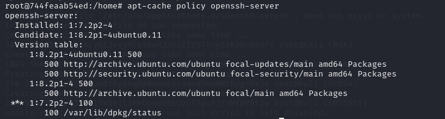
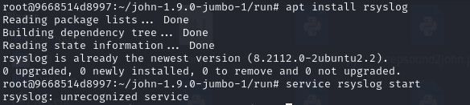

## 19/02/24 Reporte Diario
- [X] Como usar MarkDown
- [X] Que son las vulnerabilidades que no han tocado(su funcionamiento)
- [X] Como usar github Desktop

## 20/02/24 Reporte Diario

- [X] Planificación y organización del proyecto
- [X] Investigación sobre CVE y cual vamos a eligir
- [X] Planificacióm sobre que vamos hacer el proyecto(En que se va abasar)
- [X] Planificación del contenido de las maquinas(que es lo que tendrá)

## 21/02/24 Reporte Diario
- [X] Investigación sobre la primera maquina y su contenido
- [X] Pruebas de la maquinas
- [X] Primeras pruebas de la posible pagina web

## 22/02/24 Reporte Diario
- [X] Pruebas de la maquinas
- [X] Investigación y pruebas de FTP
- [X] Finalización de las pruebas de FTP

## 23/02/24 Reporte Diario
- [X] Pruebas de la maquinas
- [X] Investigación sobre como retringir a los usuarios de hacer que cosas si y que cosas no
- [X] Creación de usuarios
- [X] Planificación lógica de la maquina(Historia de la maquina)

## 26/02/24 Reporte Diario
- [X] Testing de la primera maquina
- [X] Investigación de errores

## 27/02/24 Reporte Diario
- [X] Testing de la primera maquina
- [X] Redación de la maquina
- [X] soluciones de algunos errores
- [X] Readación de la explicación de la maquina

## 28/02/24 Reporte Diario
- [X] Testing de la primera maquina
- [X] Redación de la maquina
- [X] soluciones de algunos errores

## 1/03/24 Reporte Diario
- [X] Testing de la primera maquina
- [X] Uso de la herramienta binwalk para oculta unzip dentro de una foto.
- [X] Investigación sobre python library hijacking

## 4/03/24 Reporte Diario
- [X] investigación sobre herramienta forense
    - hay fichero que no se encuentra en el los docker que complica la ejecución del forense
- [X] Error al instalar una versión anterior del Openssh-server
    - El errores es que no en los repositorios estandar no se encuentra dicha version porque es muy antigua y no cumple ya con los estandar de seguridad del sistema
       wget https://mirrors.wikimedia.org/ubuntu/ubuntu/pool/main/o/openssh/openssh-server_7.2p2-4_amd64.deb
       sudo dpkg -i --force-all openssh-server_7.2p2-4_amd64.deb
       //
       apt --fix-broken install
       apt-cache policy openssh-server

## 5/03/24 Reporte Diario
- [X] intentado solucionar el error que no deja iniciar el docker porque no tenia está libreria **libcrypto.so.1.0.0**
wget http://security.ubuntu.com/ubuntu/pool/main/o/openssl1.0/libssl1.0.0_1.0.2n-1ubuntu5.13_amd64.deb
apt install ./libssl1.0.0_1.0.2n-1ubuntu5.13_amd64.deb
Y después comentar la linea include del fichero /etc/ssh/ssh_config
    - [X] Nuevo error que no me deja iniar la maquina 

## 6/03/24 Reporte Diario
- [] Problemas con el servicio rsyslog, una vez que lo descarga y intenta iniciar el servico no lo encuentra.

